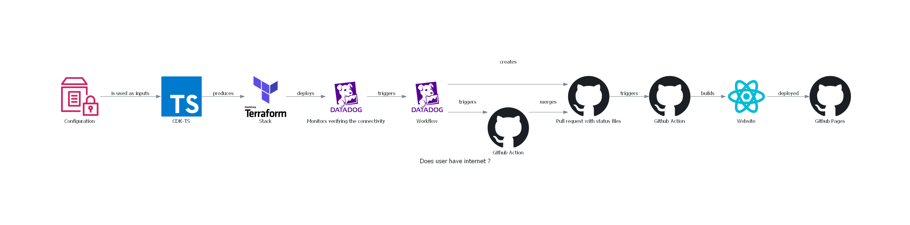
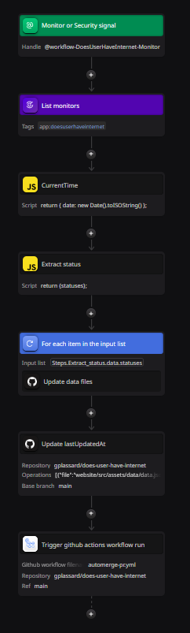

# Does user have internet

Sources for the [https://gplassard.github.io/does-user-have-internet/](https://gplassard.github.io/does-user-have-internet/) website.

This is a silly project and just a pretext to use (far too many) tools, please don't use it as an exemple !

But does it work ? Yes !

# Tools

* [Datadog Monitors](https://docs.datadoghq.com/getting_started/monitors/)
* [Datadog Workflow Automation](https://docs.datadoghq.com/service_management/workflows/)
* [Terraform CDK](https://github.com/hashicorp/terraform-cdk)
* [AWS Systems Manager Parameter Store](https://docs.aws.amazon.com/systems-manager/latest/userguide/systems-manager-parameter-store.html)
* [Github Actions](https://github.com/features/actions)
* [Projen](https://projen.io/)
* [Diagram As Code](https://diagrams.mingrammer.com/)
* ...

# Architecture




# Roadmap (because why not ?)

* Put Parameter Store in a CDK stack
* Continuous deployment for terraform & CDK changes
* Snapshot tests
* Update infra diagram through a github action when code / dependency change
* Website as a projen project
* Github action to update python dependencies
* Make history pages / retrieve SLO information

# Installation / instructions

* You need an AWS Account and access credentials
  * Configure S3 Bucket for Terraform State
  * Configure Parameter Store for Configuration
* You need a Datadog Account and access credentials
* [Access to github registry](https://docs.github.com/en/packages/working-with-a-github-packages-registry/working-with-the-npm-registry)
* Have pnpm / nodejs / python / pipenv

```bash
# Installation
pnpm install # install node dependencies
cd website && yarn install # install dependencies for website 
pipenv install # install python dependencies
pipenv shell # start a shell with python environment

# Useful commands
python ./docs/architecture/diagram.py # generate architecture diagram
cd website && yarn dev # start website locally
pnpm run cdktf apply # deploy terraform stack
pnpm run projen # update project files managed by projen
```
